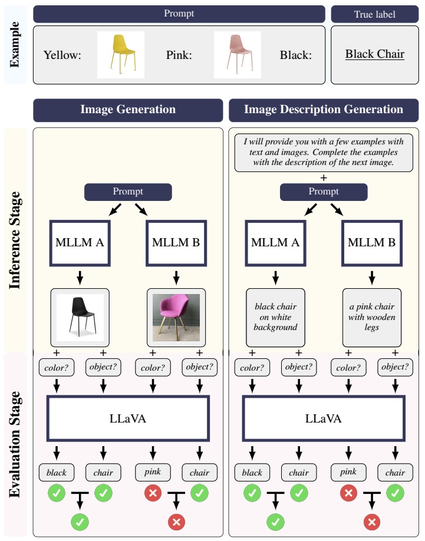

<h1 align="center"> <p>Enhance Multimodal In-Context Learning for Text-to-Image Generation</p></h1>

This final project is based on this github project: https://github.com/UW-Madison-Lee-Lab/CoBSAT. 


# Contents

- [Step 1: Set Up Environment](#step-1-set-up-environment)
- [Step 2: Download Dataset](#step-2-download-dataset)
- [Step 3: Select MLLMs](#step-3-select-mllms)
  - [Supported Models](#supported-models)
  - [Feature Your Own Model](#feature-your-own-model)

- [Step 4: Benchmark MLLMs](#step-4-benchmark-mllms)
  - [[Optional] Fine-Tuning Stage](#optional-fine-tuning-stage)
  - [Inference Stage](#inference-stage)
  - [Evaluation Stage](#evaluation-stage)
- [Step 5: Cite Us](#step-5-cite-us)

# Step 1: Set Up Environment

To set up the environment for benchmarking MLLMs, please follow the following steps. This works for linux. 

1. Clone this repository and rename it as `cobsat`

   ```bash
   git clone --recurse-submodules https://github.com/LexiYin-mh/T2I-ICL-Low-Semantic
   mv CoBSAT cobsat
   cd cobsat
   ```

2. Install Packages 

  **Linux**

   ```bash
   # create the environment that works for most of the cases
   conda create -n cobsat python=3.8.18
   conda activate cobsat
   pip install torch==2.1.2 torchvision==0.16.2 
   pip install -r conda_env/default_requirements.txt
   
   # create the environment for llava to work 
   conda create -n llava python=3.10.13
   conda activate llava
   pip install --upgrade pip  # enable PEP 660 support
   pip install git+https://github.com/yzeng58/LLaVA/@a61aae093656922fe16ec2152b031dd1de72fe92
   pip install -r conda_env/llava_requirements.txt

   # create the environment for gemini to work 
   conda env create -f conda_env/gemini.yml

   # create the environment for llava16 (LLaVA-NeXT) to work 
   conda env create -f conda_env/llava16.yml
   ```

3. Create `environment.py` in the `cobsat` directory. Note that many variables need you to config except `root_dir` on your own

   ```python
   # Configure the environment variables for the project
   
   import os
   root_dir = os.path.dirname(os.path.abspath(__file__))
   
   SEED_PROJECT_ROOT = f'{root_dir}/models/SEED'
   
   ###############
   # NEED UPDATE #
   ###############
   TRANSFORMER_CACHE = '/data/.cache/huggingface/hub' 
   
   # WANDB Logging https://wandb.ai/site
   WANDB_ENTITY = 'your-wandb-entity'
   WANDB_PROJECT = 'your-wandb-project'
   ```

# Step 2: Download Dataset and Model Weights


To use our dataset, please follow the following steps. 

1. Download the images and their corresponding descriptions of our dataset.

   ```bash
   wget "https://huggingface.co/datasets/yzeng58/CoBSAT/resolve/main/datasets.zip"
   ```
2. Uncompress the `datasets.zip` file via `unzip datasets.zip` and move the `datasets` folder into your `cobsat` folder. 

Up to now, the structure of your `cobsat` folder should look like this.

```
.
├── ...          
├── datasets                # download the dataset in this step
├── load_models
│   ├── call_emu.py
│   ├── call_emu2.py
│   ├── call_gill.py
│   ├── call_gpt.py
│   ├── call_llava.py       # LLaVA-1.5
│   ├── call_llava16.py     # LLaVA-NeXT 
│   ├── call_qwen.py
│   ├── call_seed.py
│   ├── call_gemini.py
│   ├── call_claude.py
│   ├── call_your_model.py  # [optional] create python file to load the model you want to evaluate
│   └── ... 
├── models                  
│   ├── SEED                
│   ├── gill                
│   ├── Emu                 
│   │   └── Emu1 
│   ├── LLaVA               
│   ├── Qwen-VL    
│   ├── Gemini
│   ├── Claude   
│   ├── OwnModel            # [optional] input your own model folder
│   └── ...
├── ...
├── environment.py          # follow the instruction above to create this file
├── load_model.py           # [optional] add your own model                
└── ...
```

# Step 3: Set up MLLM (SEED-LLaMA)

3. Follow the instruction in [SEED-LLaMA](https://github.com/AILab-CVC/SEED), install model weights. 

Besides, this repository also allow testing for other MLLMS listed on the directory below. 

## Supported Models

- [x] [SEED-LLaMA](https://arxiv.org/abs/2310.01218)
  * Image Generation
  * Text Generation
  * Fine-Tuning
- [x] [GILL](https://arxiv.org/abs/2305.17216)
  * Image Generation
  * Text Generation
- [x] [Emu](https://arxiv.org/abs/2307.05222)
  * Image Generation
  * Text Generation
- [x] [Emu2](https://arxiv.org/abs/2312.13286)
  * Image Generation
  * Text Generation
* [x] [GPT-4V]()
  * Text Generation
* [x] [LLaVA-1.5](https://arxiv.org/abs/2304.08485)
  * Text Generation
* [x] [LLaVA-1.6/LLaVA-NeXT](https://llava-vl.github.io/blog/2024-01-30-llava-next/)
  * Text Generation
* [x] [Qwen-VL](https://arxiv.org/abs/2308.12966)
  * Text Generation
  * Fine-Tuning
* [x] [Gemini](https://arxiv.org/abs/2312.11805)
  * Text Generation
* [x] [Claude](https://www.anthropic.com/claude)
  * Text Generation


# Step 4: Benchmark MLLMs



## Fine-Tuning Stage

```bash
# Example
# activate the default environment
conda activate micl

python finetune_icl.py \
--model qwen \
--shot 2 \ 							
--prompt_type default \
--gen_mode text \
--ft_mode leave_one_out \
--eval_task_theme texture
```

<details><summary> Parameter Descriptions </summary>

  - **`model`**: Specifies the model for fine-tuning. Currently, only `qwen` (Qwen-VL) is supported.For integrating your own model, refer to the section [Feature Your Own Model](#optional-feature-your-own-model).
  - **`shot`**: Defines the number of demonstration examples included in each training prompt.
  - **`prompt_type`**: Selects the type of prompt to use. Available options include:
    - `default`: The standard prompt design as described in our paper.
    - `misleading`: Introduces misleading information in the textual input of each demonstration, as detailed in the appendix.
    - `cot` (Chain of Thought): Incorporates multi-step inference prompts, prompting the model to generate reasoning steps ("let's think step by step") before the final output.
    - `exact`: Directly provides the ground truth label as the textual input.
    - `caption`: Replaces images in the prompt with their corresponding captions.
    - `instruct`: Adds an additional sentence explicitly stating the relationship between textual input and visual output in each demonstration.
  - **`gen_mode`**: Determines the output mode of the model, with two options:
    - `image`: The model generates an image output.
    - `text`: The model generates textual descriptions for the next image.
  - **`ft_mode`**: The fine-tuning mode used in the experiment, with two options:
    - `all`: fine-tune on subsets of all tasks
    - `leave_one_out`: fine-tune on entire set of other four themed-tasks
  - **`eval_task_theme`**: The theme will be evaluated on (the theme that is excludede in fine-tuning). Default is empty string `''`. Only use it when `ft_mode` set to be `leave_one_out`.


</details>

The fine-tuned models will be stored in `ft_models/`.

## Inference Stage

```bash
conda activate cobsat

python inference_icl.py \
--model seed \
--prompt_type default \
--gen_mode image \
--shot 2 4 \
--seed 123 \
--device cuda \
--task_id 1 2 3 \
--overwrite 0 \
--finetuned_model 0 \
--data_mode default \
--eval_mllm llava \
--ft_mode all \
--eval_task_theme ''
--low_semantic 0
```

<details><summary> Parameter Descriptions </summary>

- **`model`**: Specifies the model for making the inference. The supported models include `seed` (SEED-LLaMA), `gill` (GILL), `emu`  (Emu), `emu2` (Emu2), `gpt4v` (GPT-4V), `llava` (LLaVA-1.5), `llava16` (LLaVA-1.6/LLaVA-NeXT), `gemini` (Gemini), `claude` (Claude) and `qwen` (Qwen-VL).  
- **`shot`**: Defines the number of demonstration examples included in each training prompt.
- **`prompt_type`**: Selects the type of prompt to use. Available options include:
  * `default`: The standard prompt design as described in our paper.
  * `misleading`: Introduces misleading information in the textual input of each demonstration, as detailed in the appendix.
  * `cot` (Chain of Thought): Incorporates multi-step inference prompts, prompting the model to generate reasoning steps ("let's think step by step") before the final output.
  * `exact`: Directly provides the ground truth label as the textual input.
  * `caption`: Replaces images in the prompt with their corresponding captions.
  * `instruct`: Adds an additional sentence explicitly stating the relationship between textual input and visual output in each demonstration.
- **`gen_mode`**: Determines the output mode of the model, with two options:
  * `image`: The model generates an image output.
  * `text`: The model generates textual descriptions for the next image.
- **`seed`**: An integer used to set the random seed for reproducibility.
- **`device`**: Specifies the computing device for the experiments. The default value is `cuda`, which utilizes a single GPU.
- **`task_id`**: Identifies the task being performed. By default, all ten tasks are executed. Detailed information about each task can be found in `configs.py` under the definition of `task_dataframe`, as well as in our paper.
- **`overwrite`**: Determines whether to reuse existing results or overwrite them. This is applicable when results have already been saved.
- **`finetuned_model`**: Indicates whether to use a finetuned model. If enabled, the finetuned model must be stored beforehand by executing `finetune_icl.py`, and the `data_mode` should be set to `ft_test`. 
- **`data_mode`**: Offers two options: `default` and `ft_test`. In `ft_test` mode, the dataset is divided into training and testing sets, with only the testing set being utilized.
- **`api_key`**: Indicate which key to use. In `environment.py`, you should have already chose the name for your api_key for the model you are going to use.
- **`ft_mode`**: The fine-tuning mode used in the experiment, with two options:
  * `all`: fine-tune on subsets of all tasks
  * `leave_one_out`: fine-tune on entire set of other four themed-tasks
- **`eval_task_theme`**: The theme will be evaluated on (the theme that is excludede in fine-tuning). Default is empty string `''`. Only use it when `ft_mode` set to be `leave_one_out`.
- **`low_semantic`**: Indicates whether to use low-semantic input for testing ICL ability of the model. 

</details>

The generated outputs will be stored in `results/exps/` by default or `results/ft` if `finetuned_model` is set to `True`.

## Evaluation Stage

```bash
# Example
# activate the environment for using LLaVA (since LLaVA is our evaluation model)
conda activate llava

python evaluation_icl.py \
--model seed \
--prompt_type default \
--eval_mode image \
--task_id 1 2 3 \
--shot 2 4 \
--device cuda \
--seed 123 \
--wandb 1 \
--overwrite 0 \
--finetuned_model 0 \
--data_mode default
```

<details><summary> Parameter Descriptions </summary>

- **`model`**: Specifies the model for making the inference. The supported models include `seed` (SEED-LLaMA), `gill` (GILL), `emu`  (Emu), `emu2` (Emu2), `gpt4v` (GPT-4V), `llava` (LLaVA-1.5), `llava16` (LLaVA-1.6/LLaVA-NeXT), `gemini` (Gemini), `claude` (Claude) and `qwen` (Qwen-VL).  
- **`shot`**: Defines the number of demonstration examples included in each training prompt.
- **`prompt_type`**: Selects the type of prompt to use. Available options include:
  - `default`: The standard prompt design as described in our paper.
  - `misleading`: Introduces misleading information in the textual input of each demonstration, as detailed in the appendix.
  - `cot` (Chain of Thought): Incorporates multi-step inference prompts, prompting the model to generate reasoning steps ("let's think step by step") before the final output.
  - `exact`: Directly provides the ground truth label as the textual input.
  - `caption`: Replaces images in the prompt with their corresponding captions.
  - `instruct`: Adds an additional sentence explicitly stating the relationship between textual input and visual output in each demonstration.
- **`eval_mode`**: Specifies the type of model output to be evaluated. Available options are:
  - `image`: Evaluates the image output generated by the model.
  - `text`: Evaluates the textual descriptions for the subsequent image as generated by the model.
- **`seed`**: An integer used to set the random seed for reproducibility.
- **`device`**: Specifies the computing device for the experiments. The default value is `cuda`, which utilizes a single GPU.
- **`task_id`**: Identifies the task being performed. By default, all ten tasks are executed. Detailed information about each task can be found in `configs.py` under the definition of `task_dataframe`, as well as in our paper.
- **`overwrite`**: Determines whether to reuse existing results or overwrite them. This is applicable when results have already been saved.
- **`finetuned_model`**: Indicates whether to use a finetuned model. If enabled, the finetuned model must be stored beforehand by executing `finetune_icl.py`.
- **`data_mode`**: Offers two options: `default` and `ft_test`. In `ft_test` mode, the dataset is divided into training and testing sets, with only the testing set being utilized.
- **`eval_mllm`**: The multimodal large language model used for evaluating the generated images (descriptions). The supported mllms include `llava`, `gemini`, and `qwen`.
- **`api_key`**: Indicate which key to use. In `environment.py`, you should have already chose the name for your api_key for the model you are going to use.
- **`ft_mode`**: The fine-tuning mode used in the experiment, with two options:
  * `all`: fine-tune on subsets of all tasks
  * `leave_one_out`: fine-tune on entire set of other four themed-tasks
- **`eval_task_theme`**: The theme will be evaluated on (the theme that is excludede in fine-tuning). Default is empty string `''`. Only use it when `ft_mode` set to be `leave_one_out`.

</details>

The evaluation results will be stored in `results/evals/` by default or `results/ft` if `finetuned_model` is set to `True`. If `wandb` is `True`, you can also view the evaluation results in your wandb board. 

# Reference

```tex
@article{zeng2024can,
  title={Can MLLMs Perform Text-to-Image In-Context Learning?},
  author={Zeng, Yuchen and Kang, Wonjun and Chen, Yicong and Koo, Hyung Il and Lee, Kangwook},
  journal={arXiv preprint arXiv:2402.01293},
  year={2024}
}
```

